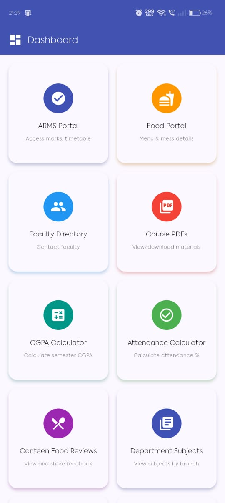
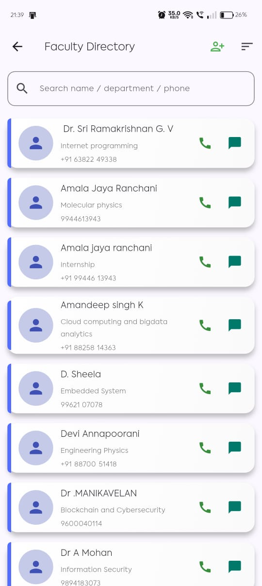
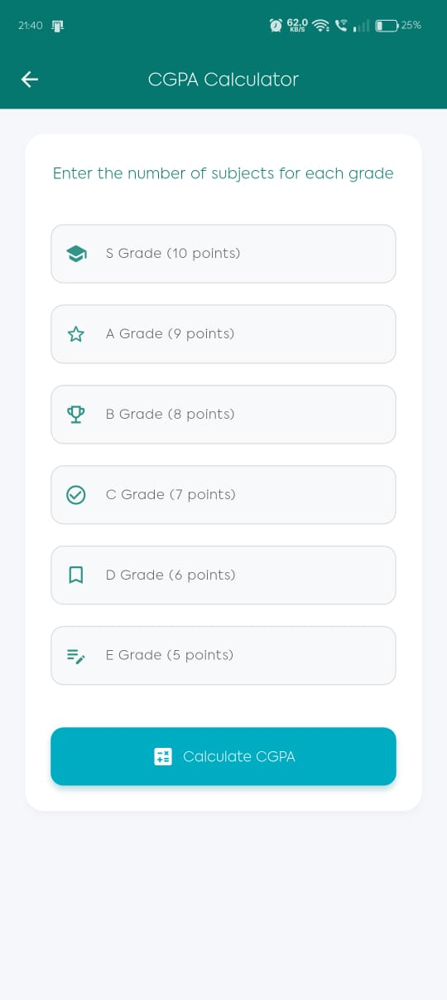

# **Simatix College Companion** 🚀

An all-in-one mobile application designed to be the ultimate companion for college students. Simatix provides quick access to academic resources, campus information, and essential tools to simplify the college experience.

[](https://flutter.dev) 
[](https://opensource.org/licenses/MIT)
[](https://github.com/Sairam-kattunga/Simatix_A-College-Connect-App/stargazers)
[](https://github.com/Sairam-kattunga/Simatix_A-College-Connect-App/network/members)

---

## **✨ Features**

Simatix is packed with student-focused features:

- **College Info:** Access official rules, departments, and general information.
- **Academic Resources:**
  - **Faculty Directory:** Complete faculty details and contacts.
  - **Course Materials:** Browse subjects and download PDFs.
- **Student Tools:**
  - **CGPA Calculator:** Quickly calculate your cumulative GPA.
  - **Attendance Tracker:** Monitor attendance to stay compliant.
- **Campus Life:**
  - **Canteen Reviews:** Read/write reviews of campus canteens.
  - **Nearby Places:** Discover essential spots around campus.
- **Stay Connected:**
  - **Social Media Hub:** Access all official college social media links.
- **Communication & Feedback:**
  - **Feedback System:** Submit app feedback.
  - **Maintenance Mode:** Get notified about ongoing app maintenance.

---

## **📸 Screenshots**

| HomeScreen                    | Faculty Directory                   | CGPA Calculator               |
|-------------------------------|-------------------------------------|-------------------------------|
|  |  |  |


---

## **📥 Quick Links**

- **App Repository:** [Simatix GitHub](https://github.com/Sairam-kattunga/Simatix_A-College-Connect-App)  
- **Share With Friends:** Simply share this link for easy access!  
- **Flutter Docs:** [Official Flutter Documentation](https://flutter.dev/docs)

---

## **🚀 Getting Started**

Follow these steps to run Simatix locally:

### **Prerequisites**

- [Flutter SDK](https://flutter.dev/docs/get-started/install)
- Android Studio / Xcode / VS Code
- Connected device or emulator

### **Installation**

1. **Clone the repository:**
```bash
git clone https://github.com/Sairam-kattunga/Simatix_A-College-Connect-App.git
````

2. **Navigate to the project directory:**

```bash
cd Simatix_A-College-Connect-App
```

3. **Install dependencies:**

```bash
flutter pub get
```

4. **Run the app:**

```bash
flutter run
```

---

## **📂 Project Structure**

```
simatix_2/
├── android/        # Android platform-specific code
├── ios/            # iOS platform-specific code
├── linux/          # Linux desktop-specific code
├── macos/          # macOS desktop-specific code
├── web/            # Web platform code
├── windows/        # Windows desktop platform code
├── assets/         # Images, logos, and static assets
├── lib/            # Core Dart code
│   ├── screens/    # All UI screens
│   ├── utils/      # Utility functions and helpers
│   └── main.dart   # App entry point
├── test/           # Automated tests
└── pubspec.yaml    # Dependencies and metadata
```

---

## **🤝 Contributing**

We welcome contributions! Here's how you can help:

1. Fork the project.
2. Create your feature branch:

```bash
git checkout -b feature/AmazingFeature
```

3. Commit your changes:

```bash
git commit -m "Add AmazingFeature"
```

4. Push to your branch:

```bash
git push origin feature/AmazingFeature
```

5. Open a pull request.

---

## **💡 Tips & Notes**

* Keep your screenshots updated in the `screenshots/` folder.
* Mention any required **API keys or configuration** in `lib/utils/config.dart` (if needed).
* Use badges to show **build status**, **version**, or **downloads** for a professional touch.

---

## **📄 License**

Distributed under the MIT License. See `LICENSE` for details.

---

**Made with ❤️ by Rama Venkata Manikanta Sairam Kattunga**
[Connect on GitHub](https://github.com/Sairam-kattunga)

```

